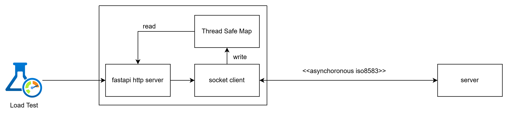
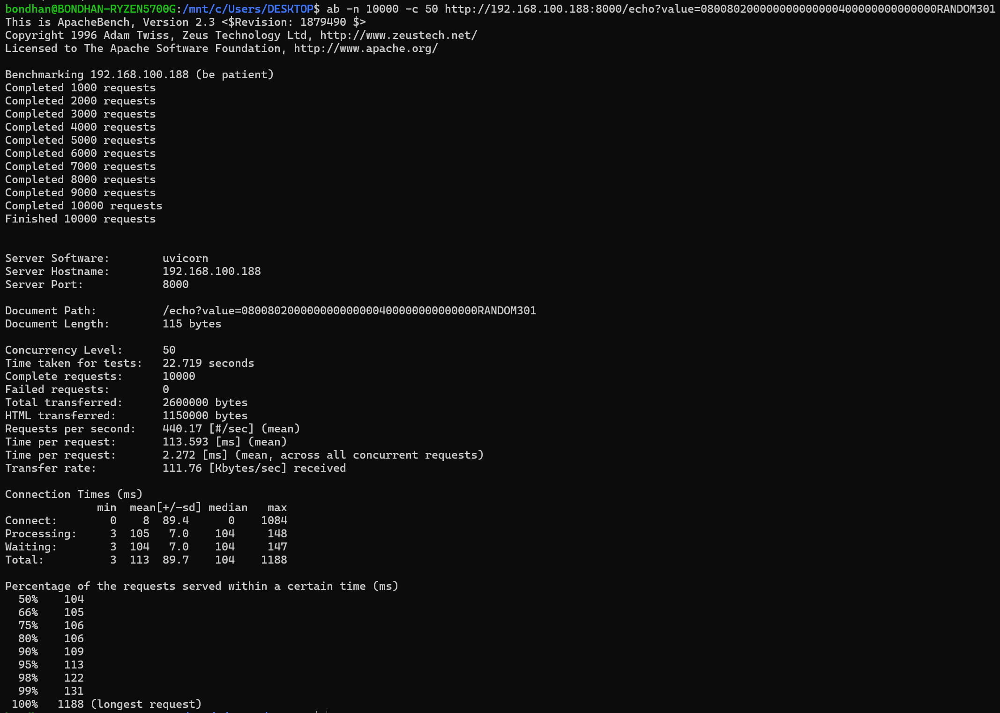

# Async ISO8583 client-server mock up

Inspired from:
- https://alovak.com/2024/08/27/mastering-iso-8583-message-networking-with-golang/

but in python



## How To Run
### In cmd

change the PYTHONPATH to whichever directory you are working on

```bash
  make run-server
```
```bash
  make run-client 
```

### Using Docker
```bash
  docker-compose up -d
```
### Test
```bash
  curl --location 'http://localhost:8000/echo?value=080080200000000000000400000000000000RANDOM301'
```
Response
```json
{
    "sent": ": 080080200000000000000400000000000000423482301",
    "resp": "08108020000002000000040000000000000042348200301"
}
```

### Load Test



### ToDo:
- Use Redis instead of internal map

### Reference:
1. https://github.com/Seedstars/python-iso8583
